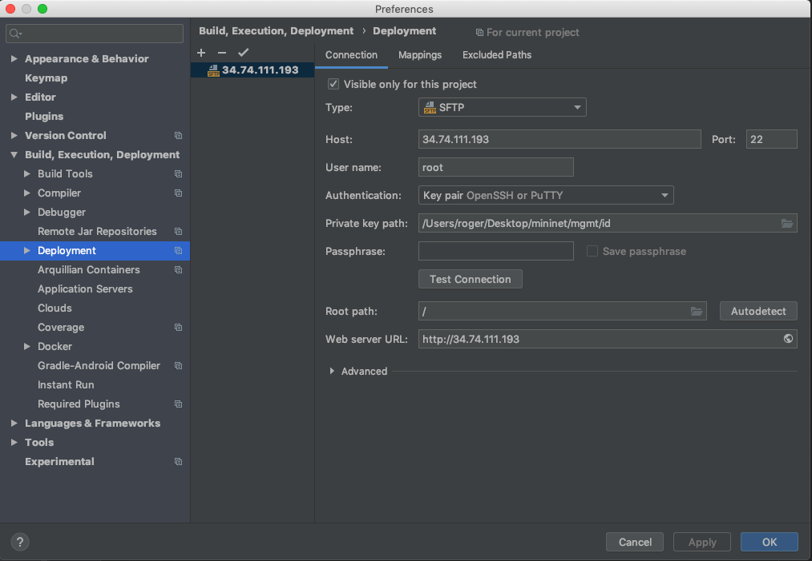
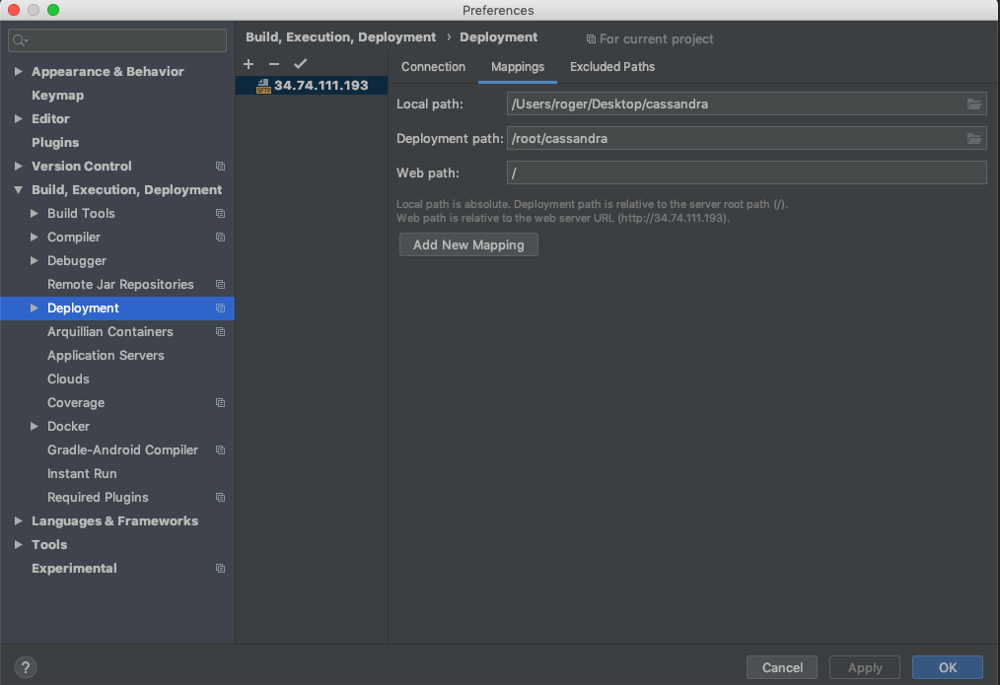
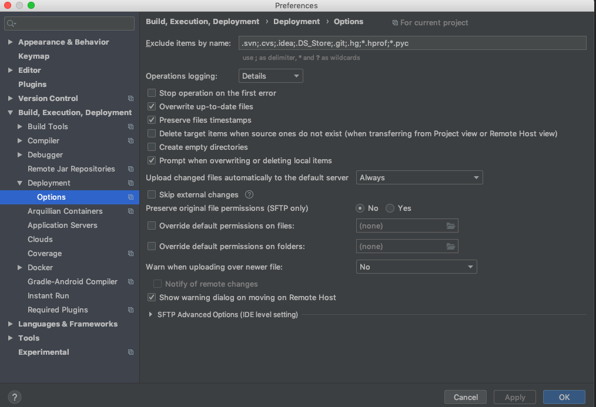

## local environment for IDEA (streamline uploading)

> Important: The below ip may not work. The newest ip see  External Ip on GCP

In IDEA, config the following, so that you can use Tool -> Deployment and Tool -> Start SSH Session





The below is not modified, just FYI



Therefore, every time we move the mouse out of the editor, a File Transfer window should say the changed file has been uploaded and so it replaces the remote original file.

How to verify? `git status` or `ant build` or `python topo_cass.py -b` (see the next seciton) to see whether the change has been reflected.


## firing up Cassandra (streamline debugging)

* open a terminal as root
* go to `/root/mgmt/`
* run `python topo_cass.py -c -t -s -l` if you want to clear `cassandra/data`, `cassandra/logs` folders, create a Mininet topology, run 5 Cassandra nodes on that, and load the schema (see `load.sh` below)
* run `python topo_cass.py -c -f -b -t -s -l` if you want to do `ant clean` and `ant build` in addition to what mentioned above
* more help on switches see `python topo_cass.py`
* `Ctrl + D` to terminate Mininet, (`killall java` if there are Cassandra nodes remaining)

### `load.sh`

See `mgmt/load.sh`, it defines what schema (ycsb.usertable) Mininet loads so you may want to change that. With slight modification, it also works for good old Cassandra without Mininet.

### `reset.sh`

See `mgmt/load.sh`, it does hard git reset and copy `cassandra.yaml` to the `cassandra/conf` folder

## gotchas

`chmod 400 *.pub` if there's an issue with local private ssh key

"man-in-the-middle-attack" during SSH connection -> `rm ~/.ssh/known_hosts` locally


## for deployment personnel

### GCP specs

* Project wide meta data: enable-oslogin: TRUE (for faster SSH sessions)
* Zone: us-east1-b
* Machine type: n1-standard-16 (16 vCPUs, 60 GB memory)
* OS: Ubuntu 14.04 LTS
* 10 GB standard persistent disk
* Static IP

### Before running `setup.sh` 

upload cassandra.yaml, id.pub, and setup.sh, then
```shell
sudo su
cd
# replace "panhi_bc_edu" with your username
mv ../home/panhi_bc_edu/id.pub ../home/panhi_bc_edu/setup.sh ../home/panhi_bc_edu/cassandra.yaml ./
. setup.sh
```
these three files will be deleted after running `setup.sh`


### remote directories
> Important: We should work in the root directory to make our works available to others. Use `sudo su` to become the root user first.

Run `setup.sh` and do Pycharm remote mapping (introduce later), we should see

* cassandra
* mgmt
* mininet
* redis
* redis-stable 
* ycsb-0.15.0

folders in the `/root` directory, where `mgmt` is the remote mapping of this project.


### Pycharm remote mapping
* setup SSH interpreter (so Deployment will come up automatically)
* Path mapping: `<Project root>→/root/mgmt`

### what I changed in `cassandra.yaml`

* seeds
* listen_address, listen_interface
* rpc_address
* auto_snapshot


### Pycharm: run into miscellaneous errors

Open Preferences

Project: Mininet -> Reset Project Intepreter

Build, Execution, Deployment -> Reset Deployment

### Pycharm: good to know

Tool -> Start SSH Session

Tool -> Deployment

Right click a folder/file -> Deployment

### Notes on Kishori's Library

Right now, `setup.sh` only clones his library to the machine.
On May 29th, I did the following to let `make test` works:
```
# now it is in `setup.sh`
apt-get install yasm -y

cd

# now it is in `setup.sh`
git clone https://github.com/kishori82/JavaISal.git 

cd JavaISal
make -f Makefile.unx
cd javaexample
vim Makefile
# line 19: add -std=c99 after gcc
# line 20: add -std=c99 after gcc
# make clean <- a useful command :)
make
make test


```
 

### Other Notes

now we do `ssh-keygen -m PEM -f id -C root` on MacOS to generate SSH keys

